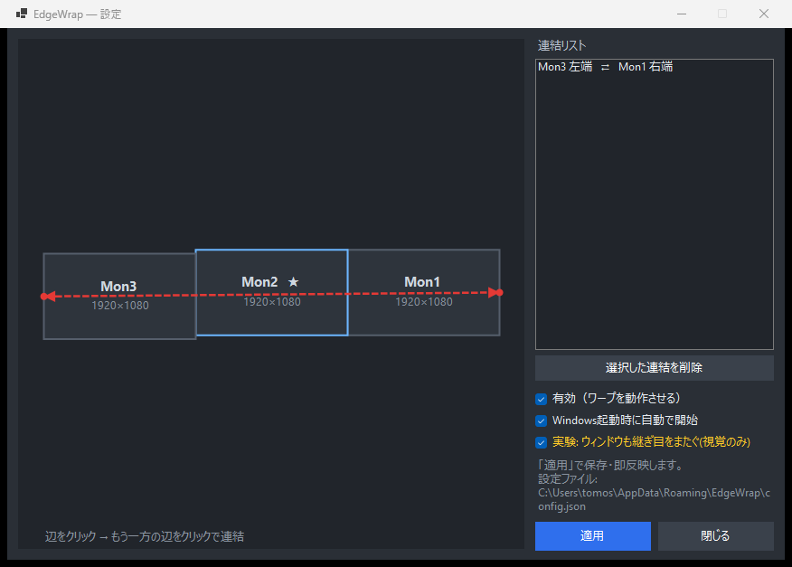

# EdgeWrap

[日本語](README.md) / **English**

Wrap the mouse cursor across multi-monitor edges — donut / torus-style.

Move the cursor off the far edge of one monitor and it reappears on the opposite
edge of another, as if your monitors were joined into a loop. Configure exactly
which edges connect with a visual monitor map.

> Originally built to join the **left edge of the leftmost monitor** to the
> **right edge of the rightmost monitor**, so the cursor travels in a continuous
> ring across a triple-monitor setup.



## Features

- **Donut cursor wrap** — connect any monitor edge to any other (left↔right, top↔bottom).
- **Visual monitor map** — click one edge, then another, to link them. Drawn to scale.
- **Proportional mapping** — different resolutions and vertical offsets are absorbed,
  so the cursor never lands in a gap between mismatched monitors.
- **Tray resident** — runs quietly in the system tray; enable/pause from the menu.
- **Start with Windows** — optional auto-start at login.
- **Single self-contained `.exe`** — no .NET runtime required for end users.
- **Experimental: seam mirror** — when a window is dragged past a wrap seam, its
  off-screen part is mirrored onto the opposite monitor via a live DWM thumbnail,
  so the window *looks* like it wraps around the donut. Visual only (see Limitations).

## Install

1. Download `EdgeWrap.exe` from the [Releases](../../releases) page.
2. Run it. It lives in the system tray.
3. Open **Settings (設定…)** from the tray icon, click two edges on the map to link
   them, and press **Apply (適用)**.

No installer, no .NET runtime needed (the release exe is self-contained).

## Usage

- **Tray menu**: Settings, Enable/Pause, Start with Windows, the seam-mirror toggle, Quit.
- **Settings window**: click an edge → click another edge → they are linked (shown as a
  dashed arrow). Select a link in the list and remove it. Toggle auto-start. Press Apply.
- Config is stored at `%APPDATA%\EdgeWrap\config.json`.

## Build from source

Requires the .NET 8 SDK.

```powershell
# run locally
dotnet run --project src/EdgeWrap

# self-contained single-file exe (no runtime needed to run it)
dotnet publish src/EdgeWrap/EdgeWrap.csproj -c Release -r win-x64 `
  --self-contained true -p:PublishSingleFile=true `
  -p:IncludeNativeLibrariesForSelfExtract=true -o publish
```

For a much smaller, framework-dependent build (requires the .NET 8 Desktop Runtime
on the target machine), drop `--self-contained true` and the single-file flags.

## How it works

A background thread polls the cursor (~6 ms). When the cursor is pressed against a
linked edge *and* that edge is on the outer boundary of the virtual desktop, the
cursor is teleported to the partner edge. The position along the edge is mapped
proportionally (`ratio = pos / length`), which is what absorbs resolution and
vertical-offset differences between monitors.

The seam mirror uses `DwmRegisterThumbnail` to live-render the off-screen strip of a
window onto a click-through, top-most overlay on the opposite monitor.

## Limitations & roadmap

- **Windows that span a wrap seam can't be drawn natively.** The donut is a cursor
  *teleport*; the two wrapped edges are not actually adjacent in Windows' (flat) virtual
  desktop, so the OS cannot render one window across the seam. The seam mirror fakes the
  *visual*, but it is **display-only**.
- **Torus input is blocked by the OS.** Making the mirrored strip interactive would
  require placing the real cursor on the window's off-screen part — but Windows confines
  the cursor to the union of real displays, so it can never go there. Synthetic input
  (`PostMessage`) works only for some classic Win32 apps.
- **v2 idea:** a real *torus desktop* needs genuine screen space where the wrapped part
  lives. The intended path is an **indirect display driver (IDD)** that creates a virtual
  monitor; the cursor *can* enter it, so input works universally, and it gets mirrored
  back. That is a separate, heavier project tracked as a future experiment.

## License

[MIT](LICENSE) © 0ch4
